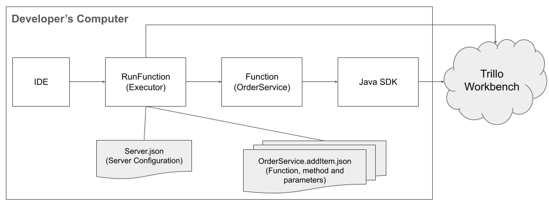

# **Trillo Workbench - Development using IDE**

This tutorial provides instructions on how to develop serverless functions for the Trillo Workbench using an Integrated Development Environment (IDE).

---

## Prerequisites:
- Java IDE (Java 8 or above)
- Cloned Trillo Workbench repository
- The repository should be imported as a new Maven project. (Make sure you don’t import it as a project or directory).
- Access to a Trillo Workbench running on the cloud (URL and credentials)
- Credentials to access the Trillo Workbench via client

---

## Understanding Trillo Functions and how they differ from Lambda or Cloud Functions:
- Trillo functions use Trillo Workbench APIs and don't handle cloud APIs or database connections.
- They are deployed by Trillo Workbench, eliminating the need for CI/CD pipelines.

---

## Anatomy of a Trillo Function:
- Each function has structures corresponding to one endpoint, allowing for addition or removal of methods as needed.
- Trillo Workbench publishes each method as an API using a specific convention.

---

## Development Using IDE:
- Trillo functions can run inside an IDE through an executor program,(src/main/java/io/trillo/RunFunction.java, provided in the repo). 
- It reads credentials from environment variables.
  - TRILLO_WB_USER_ID
  - TRILLO_WB_USER_PASSWORD
    
  These credentials are the ones which are used to login to Trillo Workbench and should be set as environment variables under Configuration settings as follows:
  

    TRILLO_WB_USER_ID={userId};TRILLO_WB_USER_PASSWORD={password}
- The executor connects with Trillo Workbench, authenticates, and acquires an access token for API calls.
- config/Server.json contains the Trillo Workbench configuration and function details file.

---

## Configuring Trillo Workbench:
- Update the Server.json file with the Trillo Workbench URL and user credentials.
- Provide the function details file, which specifies the function and method to be executed.

---

## Specifying Function Details:
- Create a JSON file with the function name, method name, and parameters to be passed to the method.
- Name the file in the format <functionName>.<methodName>.json.

---

## Running Functions in an IDE:
- Copy the provided code template, change the class and method names, and ensure it inherits from ServerlessFunction.
- Write your code using Trillo Workbench APIs.
- Update the Server.json file and specify the function details file.
- Set RunFunction as the main class and start running or debugging.

---

## Additional Information:
- Refer to the Trillo Workbench Developer Guide for more details on the anatomy of Trillo functions and their structure.
- Utilize Trillo Workbench APIs for writing code and consult the references provided for more information.

---

## High level Interactions
For more details, please consult this document - docs/TrilloWorkbench-DevelopmentUsingIDE.pdf

Based on the above document, a complete interaction diagram is shown below.

---
## References
- https://trillo.gitbook.io/trillo-workbench
