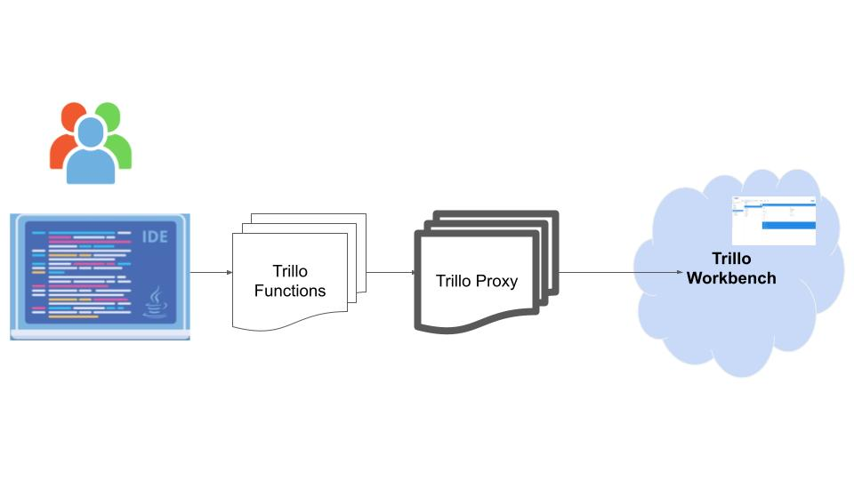

# Writing Serverless Functions for Trillo Workbench on the Google Cloud
**This repo is for developing and debugging serverless functions in your local IDE  while executing all APIs needed in the application remotely on the cloud.**
Trillo Workbench (www.trillo.io) is a platform that lets you create an application for the cloud while hiding its complexities. Trillo Workbench documentation covers all features in details [Trillo Workbench](https://trillo.gitbook.io/trillo-workbench).

In short, while building a cloud application, there are 4 major problems that require significant effort.

1. Cloud configuration (DevOps)
2. Creating databases (SQL, NoSQL etc.)
3. Transfer large files to/from cloud (buckets)
4. Writing microservice/serverless functions code and debugging them.

Trillo Workbench addresses these problems as follows:

1. Eliminates DevOps by providing a platform running on Kubernetes.
2. Enables creation of databases and their schema in a model driven way.
3. Provides an out-of-the-box application for upload, download and management of files on the cloud storage buckets.
4. **Writing and debugging of serverless functions in a local IDE (the topic of this repo).**

Let us assume that you have created a few database tables in cloud SQL or in BigQuery. You have uploaded a few files that you need to process on the cloud. **Now, you want to write business logic in a serverless manner and expose them as API, run as a background job based on a trigger or a scheduler.**

**Trillo Workbench enables you to write serverless functions in your IDE on a local machine. Without realizing, you would be writing a function for the cloud and it will be executing on it. You would be able to do source line debugging, set breakpoints, etc. Once the function is tested, it can be deployed on the cloud via Git or directly using a command line. This is depicted in the following diagram.**




# Set up local environment for the development

Assuming that you have used a single click deployment of Trillo from the Google Marketplace and deployed in your local Google Cloud Environment (VPC), follow the steps below to setup your local environment.

1. Clone this repository.
1. Load project in your IDE using the included POM.


## Prerequisites

1. You need to have the URL of the Trillo Workbench Runtime on the Google Cloud.
2. The admin of Trillo Workbench has added you as a user to it using its User Management UI and provided userId and password (which you can change by logging in to the Trillo Workbench).
3. Using Trillo Workbench UI, you have created a few database tables and uploaded a few files you need to use in your project.
4. Understand anding of the anatomy of [ Trillo Serverless Functon](https://trillo.gitbook.io/trillo-workbench/serverless-functions)
5. Copy the sample_trillo_config.json as trillo_config.json. 
6. The content of the trillo_config.json will be as follows. Replace the value of serverUrl, userId and password.

```
{
  "serverUrl" : "<url of the server>",
	"userId" : "<login user name>",
	"password" : "<password>",
	"orgName" : "cloud",
	"appName" : "main"
}
```

In the above JSON:

**serverUrl**: URL of the Trillo Workbench deployed on the Google Cloud.

**userId**: user id of the user given by the admin.

**password**: password of the user.

**orgName**: This is the name of the workspace. It is generally **“cloud”** (Trillo platform is also used to create other applications like Trillo Workbench UI. In that case the workspace name will be known to the developer.

**appName**: The name of the application. It is “main” for the “cloud” workspace.

### Important Note about trillo_config.json.
The program uses trillo_config.json and not the sample_trillo_config.json. It has to be created. It contains the actual credentials. This file (trillo_config.json) is added to .gitignore to avoid an accidental check-in.

# Java main program for local development

The main program _**Run.java**_ calls a cloud function and executes it. _**Run**_ is called without any parameters. the following parameters as follows:

**An example is shown below:**

java io.trillo.Run 

# How cloud function is executed

_Run_ calls the serverless function after checking the parameters as follows.

`executeFunction("ParameterSample","./input_files/ParameterSampleInput.json");`

where,

1. ParameterSample is the name of the function.

2. `./input_files/ParameterSampleInput.json` is the input file containing the parameters to be passed to the function (for testing and development).

# How to write serverless functions

The serverless function hosted on the Trillo Workbench running on the Google Cloud follow a structure defined on the following pages:

https://trillo.gitbook.io/trillo-workbench/serverless-functions.

In the local environment these functions are written under the package “com.serverless.function”. See a few example functions:

1. ParameterSample.java : simply prints the passed parameters
2. DSApiSample.java : shows use of database API.
3. SampleFunction.java : A file that can be copied with the new name function to start writing it.

_Note; You can write a serverless function under any package name. But in order to avoid duplicate names, stick to one package name for all functions._

# How cloud services are invoked

Trillo Workbench provides an abstraction of several Google Cloud services such as Cloud SQL, Cloud Storage, BigQuery, Speech to text, text extraction etc. The platform is adding new services with each release.

**These services are available in the serverless function through SDK (Software Development Kit).**

**In the local environment, a proxy implementation of the SDK is provided that proxies each call to the Cloud. Thus you would be running a program locally, all cloud services will be actually executed on the Google Cloud.**

## What all libraries can be used in the code?

All packages, classes and their methods of JDK are available to be used in the code. In addition to that, several libraries of Apache Commons are available.


